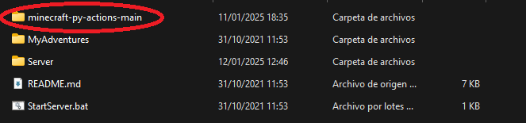

[](https://codecov.io/gh/APozo04/minecraft-py-actions)

# Minecraft Agent Framework

This project is part of a university assignment at the **Universitat Rovira i Virgili** in Tarragona. The goal of this task is to develop a Python framework that enables the creation and execution of Python-coded agents in a shared Minecraft server. These agents are able to interact with the Minecraft world by moving, building, destroying blocks, and interacting with the chat.

## Features
- **Functional Programming**: The scripts demonstrate the use of functional programming paradigms in Python. Different examples are provided to showcase how functional techniques can be used to write cleaner and more efficient code.
- **Reflective Programming**: The codebase also incorporates examples of reflective programming, allowing dynamic analysis and manipulation of objects and methods in the game, making the system highly flexible and extensible.
  
## Example Agents

The bots must be initialized by running their respective Python programs. Once running, they can be stopped by entering the corresponding command in the Minecraft chat.

- **CoordsBot**:
  When this bot is active, it responds to the following four messages in the Minecraft chat:
  - **getcoords**: Provides the player's current coordinates.
  - **getpositivecoords**: Provides the player's current coordinates but ensures all three values are positive.
  - **getnegativecoords**: Provides the player's current coordinates but ensures all three values are negative.

  Thanks to this flow, we can incorporate functional programming using `map`, `list`, and lambda expressions.

- **InsultBot**:
  This bot uses a predefined list of 10 insults (modifiable during execution in the game using reflective programming). It posts insults from the list randomly to the Minecraft chat at an initial frequency of 5 seconds (this frequency can also be changed during execution). 

  Additionally, the bot includes a set of **transformations** that can be applied to the insults. These transformations are stored in a list, with a total of 7 available, and are implemented using functional programming with lambda expressions. During execution, the player can decide which transformation to apply to the existing insults.

  When this bot is active, it responds to the following eight messages in the Minecraft chat:
  - **setinsultfreq**: Sets the frequency (in seconds) of the bot's insults (maximum of 10 seconds to ensure proper synchronization, as a long delay could result in an unreasonable execution time).
  - **listtransformations**: Displays the list of all available transformations and pauses the bot's execution.
  - **helpinsult**: Displays a list of all commands that can be used to interact with the bot and pauses the bot's execution.
  - **continueinsult**: Resumes the bot's execution if it was paused using `helpinsult` or `listtransformations`.
  - **settransformation**: Selects a transformation from the list of transformations to apply to the insults.
  - **addinsult**: Adds an insult to the list of insults.
  - **parainsultbot**: Completely stops the bot's execution (terminates the program).

- **TNTBot**:
  This bot places a TNT block and ignites it with fire directly beneath the player's position, within a radius of 5 blocks forward, backward, and to the sides. The TNT placement occurs at an initial frequency of 5 seconds (this frequency can also be adjusted).

  When this bot is active, it responds to the following two messages in the Minecraft chat:
  - **settntfreq**: Sets the frequency (in seconds) at which the bot places TNT (maximum of 10 seconds to ensure proper synchronization).
  - **paratntbot**: Completely stops the bot's execution.

## Testing

To ensure the correct functionality of the bots outside the Minecraft environment, each bot has specific tests. The bot programs are designed to detect whether they are being executed directly or invoked from a test. 

- **Direct Execution**: When a bot is run directly (e.g., `python coordsbot.py`), it executes its standard functionality within the Minecraft environment.
  
- **Test Execution**: When a bot is executed via its test suite, it utilizes the `MinecraftMock` class located in the `mocks` folder of the repository. This mock class simulates interactions with the Minecraft server, allowing the tests to run without requiring the actual server to be active.

This setup is particularly useful for continuous integration workflows. Using **GitHub Actions**, the tests can be automatically executed on each commit or pull request. The test results are then synchronized with **Codecov**, ensuring that the coverage badge displayed at the top of this document remains up-to-date with each change.


## Minecraft Server Setup

To run the Minecraft server and interact with the agent scripts, follow these steps:

1. **Download and Install Minecraft Server**:
   - Download the appropriate server package from the [Adventures in Minecraft GitHub repository for Linux/macOS](https://github.com/AdventuresInMinecraft/AdventuresInMinecraft-Linux) or the [Adventures in Minecraft GitHub repository for Windows](https://github.com/AdventuresInMinecraft/AdventuresInMinecraft-PC).
   - Ensure you have **Java 8** installed, as the server requires this version of Java to run correctly. If you have a newer version, you might need to install Java 8 or configure the server to use it.
   - Make sure you are using the Minecraft version specified in the repository (most likely **Minecraft 1.12**) to ensure compatibility with the server and the Python scripts.

2. **Set the Repository Location**:
   - Place the folder of this repository (`minecraft-py-actions-main`) inside the `Adventures in Minecraft` folder as shown in the image below:

     

3. **Start the Server**:
   - Open the `startServer.bat` (Windows) or `startServer.sh` (Linux/macOS) file from the Minecraft server directory to start the server. 
   - After a few seconds, the server will be up and running, and you can interact with it in the game.

4. **Install Python Dependencies**:
   - You need to install the required Python libraries using `pip`. Specifically, the `mcpi` library will allow Python to interact with the Minecraft server.
   - Install the library by running the following command:
     ```bash
     pip install mcpi
     ```

5. **Run the Python Scripts**:
   - Clone this repository and execute the Python scripts in your terminal or Python environment. The scripts interact with the Minecraft server to execute actions based on your Python code.
